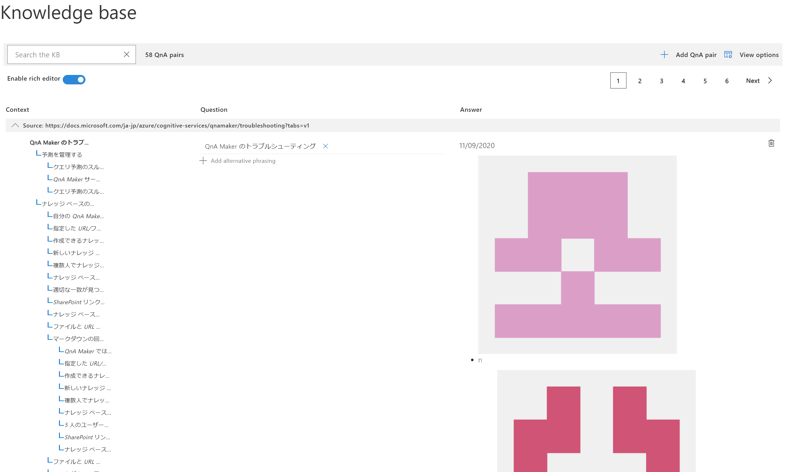
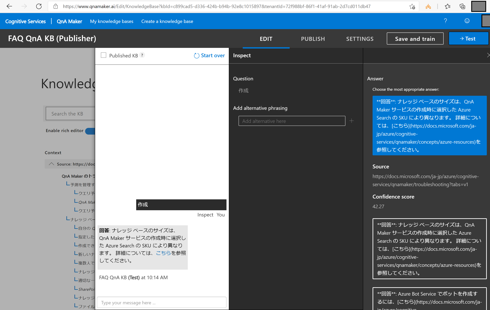
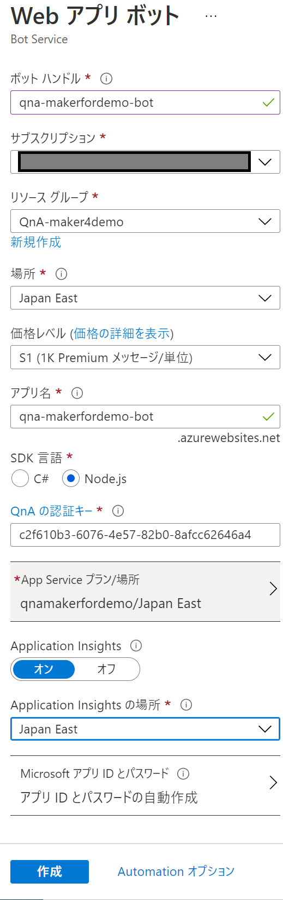
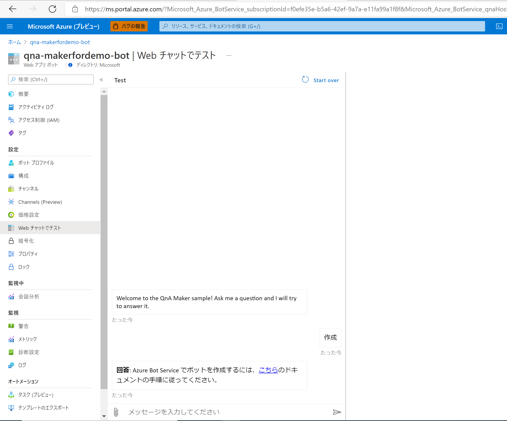

# QnA Maker Demo

## 完成イメージ

FAQ の問い合わせに対し、 Teams 経由で回答を返してくれる Chat bot を作成する。

## 前提条件

- Azure サブスクリプションを保有していること
- 必要に応じて、リソースグループを作成すること

## 手順

### 1. QnA Maker リソースの作成

[QnA Maker リソース](https://ms.portal.azure.com/#create/Microsoft.CognitiveServicesQnAMaker)を作成します。 
作成時に設定するそれぞれの値は、下図を参照してください。

### 2. ナレッジベースの作成

QnA Maker では、あらかじめ質問と回答の対である「ナレッジベース」を登録する必要があります。Chat bot は、ここで登録された質問と回答の組み合わせをもとに、投げられた質問に対して適切な回答をランク付けして返却します。

ナレッジベースとして登録できるフォーマットは、下記の通りです。

- URL
- PDF / Document
- Excel
- TXT / TSV

ここでは、「QnA Maker に関する FAQ」を掲載した下記の URL をナレッジベースとして登録する手順を示します。

[QnA Maker のトラブルシューティング](https://docs.microsoft.com/ja-jp/azure/cognitive-services/qnamaker/troubleshooting?tabs=v1)

2-1. まず、ご自身の資格情報を使って、[ QnAMaker ポータル](https://www.qnamaker.ai/)にサインインします。
2-2. QnA Maker ポータルで、画面上部「Create a knowledge base」を選択します。

2-3. [Step 2] で、`手順 1` で作成した QnA Maker リソースを、これから登録するナレッジベースと結びつけます。

2-4. [Step 3] で、自分のナレッジ ベースに <b>FAQ QnA KB</b> という名前を付けます。

2-5. [Step 4] で、次の表を使用して設定を構成します。

| 設定 | 値 |
| :--- | :--- |
| Enable multi-turn extraction from URLs, .pdf or .docx files (URL、.pdf、または .docx ファイルからの複数ターンの抽出を有効にする) | オン |
| Multi-turn default text (マルチターンのデフォルト テキスト) | Select an option |
| + Add URL (+ URL の追加) | https://docs.microsoft.com/ja-jp/azure/cognitive-services/qnamaker/troubleshooting?tabs=v1 |
| Chit-chat (おしゃべり) | [Professional]を選択します |

2-6. [Step 5]で、 [Create your KB]を選択します。

ナレッジベースの登録完了後、内部的に構文解析が行われ、質問と回答のペアが自動的に作成されます。

### 3. 保存してトレーニング

画面右上の [Save and train] をクリックし、編集内容を保存して QnA Maker をトレーニングします。これにより、内部的に学習プロセスが起動し、モデルが生成されます。

### 4. テスト

作成したナレッジベースをテストし、保存した内容が期待通りに動作するかを検証できます。 
ここでは、「作成」と入力し、返ってきた回答を検証します。回答のスコアも確認することができます。 
期待通りの回答ではなかった場合、適切な回答の選択、または新規回答の追加をすることができます。

### 5. Publish

ナレッジベースを Publish することで、ナレッジベースが Web API 経由で公開されます。

QnA Maker ポータル上に、API エンドポイントが出力されます。

### 6. ボットの作成

Publish 後、ボットを作成することが可能です。今回は、下図の通り設定をします。

作成したボットは、Azure Portal 上でテストをすることができます。

### 7. Teams で使えるよう設定する

[チャンネル] > [Connect to channels] にて、Microsoft Teams を指定することで、作成したボットを Teams 経由で使用することができます。

チャンネルの作成が完了したら、 Microsoft Teams を選択することで、作成したボットを Teams 経由で使用できるようになります。

